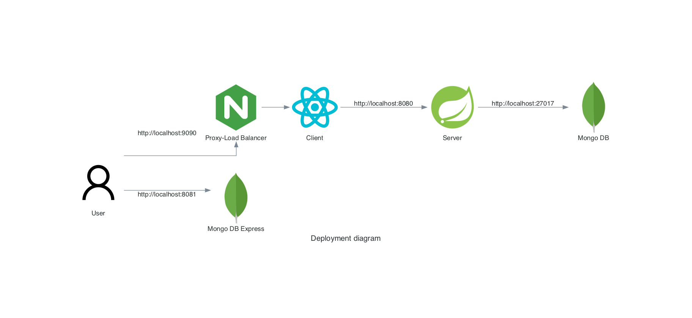

# Instructions

### Create the React Client

`npx create-react-app client` 

## 1. Run application from docker image

1. Create network before starting docker-compose:
`docker network create mongodb_network`

2. Create volumes:
`docker volume create mongodb_data`

3. Build spring-boot app: 
`mvn spring-boot:build-image`

4. Build:
`docker-compose up --build`

5. Clean up all the resources:
`docker-compose down --rmi all`

## 2. Build spring-boot app and docker container image (only):
1. Package the application: `mvn spring-boot:build-image` or `./mvnw spring-boot:build-image -DskipTests` using the Maven Wrapper and to skip the tests.
2. Build the docker image: `docker build -t spring-boot-react-demo-app .`
3. Run the container: `docker run -p 8080:8080 -t spring-boot-react-demo-app`

**Pre-requisite** 
You need to install `mvnw` before running docker to build the image
`mvn -N io.takari:maven:wrapper`
Information about the Maven Wrapper can be found [here](https://www.baeldung.com/maven-wrapper).

# 3. Run applications in the local machine

> Start the database server
`docker-compose up`

> Start the SpringBoot backend application
`mvn clean install`
`mvn spring-boot:run`

You need to start the Spring Boot application in a different port, because the docker image is running on the same port.

> Start the React client
`npm start`

# 4. Clean up

Use `docker-compose down --rmi all` to clean up all the images.

# Architecture 

